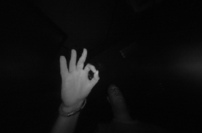
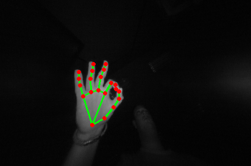
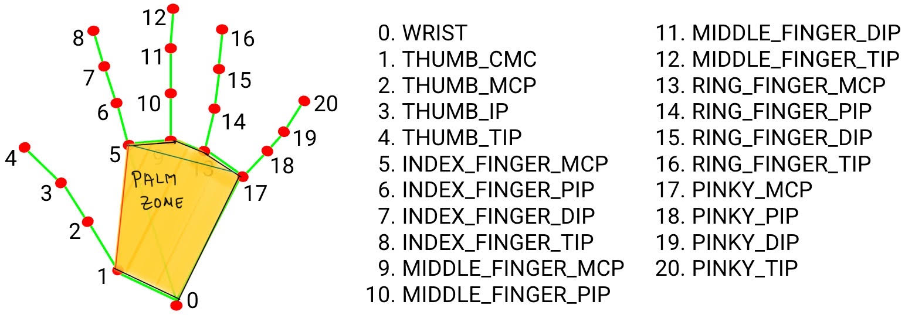

# Hand pose classification

In this project, we'll be doing hand pose classification based on the landmarks provided by [Mediapipe](https://google.github.io/mediapipe/solutions/hands#python-solution-api)
The idea is to classify the hand poses on the extracted landmarks (3D) rather than on the image itself.

I'd like to discuss 2 approaches to this problem. 
1. Using the landmarks from mediapipe to train a deep learning model to do the classification based on landmarks instead of the image itself.
2. Using the landmarks from mediapipe to classify the poses based on the landmarks. 

Video demo can be found on [youtube](https://youtu.be/3V5tQBCl8wQ)
## Dataset creation and input pipeline.

In this section,
- Downloading the data. 
- Creating dataset with hand landmarks.
- Using tf.data.Dataset to create input pipeline to the model.

### Downloading the dataset

1. Download the dataset from [link](https://www.gti.ssr.upm.es/data/MultiModalHandGesture_dataset)
2. The dataset contains 16 different gestures from 25 unique users.
3. Please note that the images are captured from a near-infrared camera.
4. The gesture is a mirror image when viewed from the back of the hand and the nail side.
5. For simplicity sake, I have selected gestures for C, five, four, hang, heavy, L, ok, palm, three, two 
6. Before running the script to extract the landmarks to a csv file, copy all images from different users.
- [ ] write a script gather train images into a single folder.

### Creating dataset with hand landmarks.

loop:
   - for image in the gesture_dir:
      - run mediapipe on the image.
      - get the landmarks.
      - save the landmarks, gesture label, file_name to a csv file.
     
usage:
   
`python3 create_data.py --gesture_folder --save_dir --save_images --name_csv`

- gesture_folder --> name of directory containing folders of gestures.
- save_dir --> name of directory to save annotated images if --save_images is True
- save_images --> flag to save annotated images or not.
- name_csv --> name of the csv file containing the hand landmarks.

 

### Creating input pipeline

1. The file at src/data.py is pretty self-explanatory for this step. 

## Training structure

1. src/train.py contains all the configuration requirements to train the model.
2. src/models.py contains the model arcitectures. Add your models here.
3. src/train.py can test the model on live webcam feed or the test set if the flags are set appropriately.

The code is pretty self-explanatory. If you need any explanations, please feel free to contact me at shreyas0906@gmail.com

## Inference

A test file is located in examples/test.csv which contains the ground truth of the pose along with filenames and the landmarks. 
The train.py has a lot of arguments which can suit your needs. 

To train on the data and test it on webcam feed:

`python3 train.py --train True --test False --test_live True`

## Method II

We define a palm zone first, which is the area as shown in the figure.
If a finger tip is in the palm zone, we can make appropriate guesses. 
The advantages of this method is that, we don't need to train a deep learning model and also we can use this model as a baseline to compare it against the deep learning based model. 
Also, since there is no inference, we can save around 5ms. (In most cases this is negligible).

A horizontal line is drawn between index_finger_mcp(5) and pinky_mcp(17) (blue line in the video)

A vertical line is drawn between index_finger_mcp(5) and thumb_cmc(1) (red line in the video)

To guess the pose, 
1. check which points are in the palm zone, by checking if it is below the horizontal
2. if the thumb is to the right of the vertical or to the left.

List of gestures we I have trained on:

| **Gesture** | **Fingers in palm zone** |
| ------- | -------------------- |
| L       | middle, ring , pinky |
| OK      | index, thumb tip |
| PALM    | None |
| TWO     | ring, pinky ,thumb |
| THREE   | pinky, thumb |
| FOUR    | thumb |
| FIVE    | None |
| HANG    | middle, ring, index | 
| HEAVY   | middle, ring | 

check out the video for this method [here]().

